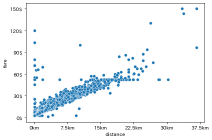

# mpl_scales: matplotlib simple tick customizer

_mpl_scales_ customize your matplotlib axes' tick location/labels simply;
```
from mpl_scaler import set_xticks, set_yticks

# set x tick every 7.5km and set the format to {n}km or {n.5}km
set_xticks(ax, diff=7.5, format=lambda x, _: f"{x:.0f}km" if x%1==0 else f"{x:.1f}km")
# set the number of y ticks to 5 and the format to {n}$ 
set_yticks(ax, n=5, format="{:d}$")
```



## Installation
You can install _mpl_scales_ using pip.
```
pip install git+https://github.com/tanaka-jin/mpl_scales
```

## Usage
_mpl_scales_ provides functions (`set_xticks` and `set_yticks`) to set tick location/labels.
Their arguments are;
- matplot Axes object: `ax`
- the position of ticks: set one of below
  - `n`: the number of ticks
  - `diff`: the interval every two ticks
  - `ticks`: the exact position of ticks (by List)
- the format of tick lavels: set one of below
  - `format`: string foramt or callable which returns string
  - `tick_labels`: each labels

for more usage see example notebook.

## Example
see `example/example.ipynb` notebook.